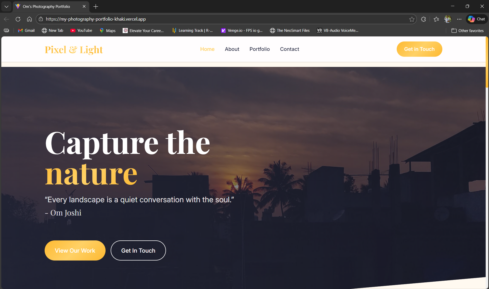
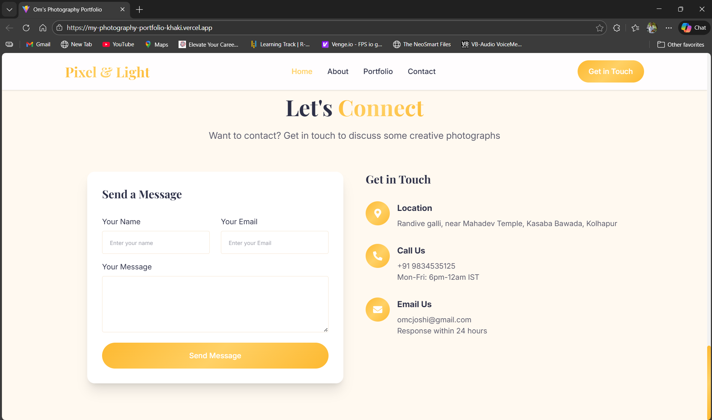

# 📸 Pixel & Light – Photography Portfolio Website

A modern and responsive **Photography Portfolio Website** built using  
**React, Vite, and Tailwind CSS** to showcase photography work with a clean and elegant UI.

---

## 🚀 Live Demo
🔗 https://my-photography-portfolio-khaki.vercel.app

---

## 🛠️ Tech Stack
- ⚛️ React
- ⚡ Vite
- 🎨 Tailwind CSS
- 🌐 Vercel (Deployment)

---

## ✨ Features
- Fully responsive design
- Photography portfolio with category filters  
  - All Photos  
  - Sunset  
  - Nature  
  - Macro
- Elegant landing section with CTA
- About section with personal branding
- Contact form with clean UI
- Modern and minimal design

---

## 👀 Project Glimpse

### 🏠 Home Page

### 🖼️ Portfolio Section

### 👤 About Section

### 📩 Contact Section

---
